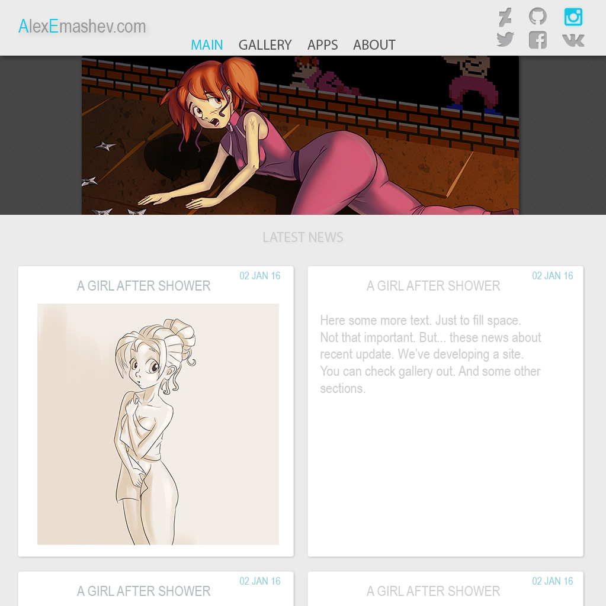
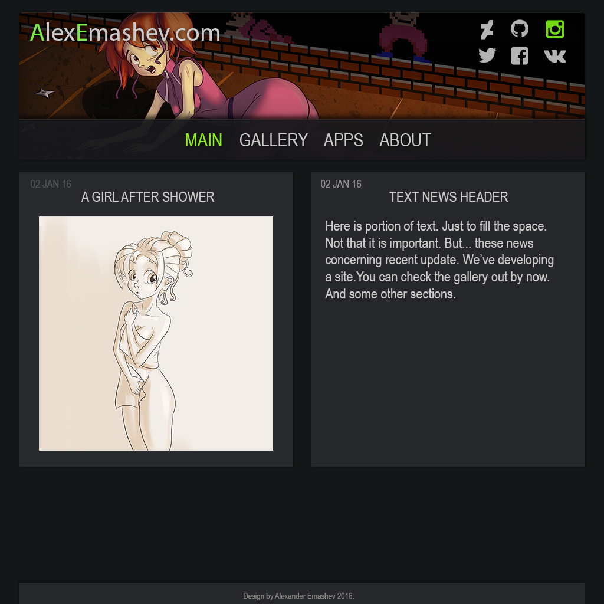

# Personal website

## About

Personal website. This is a simple and static website. I decided to store sources here for a while, since I got nothing to hide. The current state of the web-site you can check here http://alexemashev.com

Below there are couple of concepts of possible look of final project.

### Bright theme

### Dark theme

## Features

This site make use of several web-technologies:

- [Sass](https://sass-lang.com/)
- [Bourbon](https://www.bourbon.io/)
- [Jinja](http://jinja.pocoo.org/) for html templates

## License

The MIT License.

Feel free to explore and use parts of the project in your own.